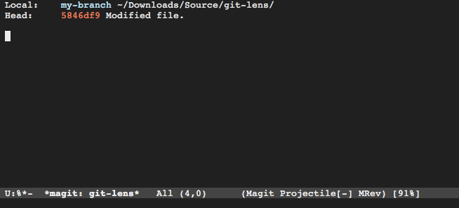

# Git Lens

A git branch browser providing a quick overview of added, deleted or
modified between `master` and the current branch.

## Usage

Visit a git-controlled file and issue `M-x git-lens` (or bind
it to a keybinding of your choice).

 - `<return>` Find file under point
 - `q` Quit

## Customize

`M-x customize [git-lens]`.
